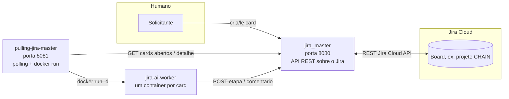

# Manual de subida local — jira_master

Passo a passo pra rodar este serviço na mão, sem depender de ninguém, mais o que eu encontrei de
problema real testando ponta a ponta com o `pulling-jira-master` e o `jira-ai-worker`.

## Onde este serviço entra no pipeline



`jira_master` é a única porta de entrada pro Jira real — nem o `pulling-jira-master` nem o
`jira-ai-worker` falam com a API do Jira Cloud diretamente.

## Pré-requisitos

- JDK 21 e Maven 3.9+ (pra rodar com `mvn spring-boot:run`), **ou** Docker (pra rodar a imagem).
- Um token de API do Jira Cloud da conta que vai autenticar
  ([gerar aqui](https://id.atlassian.com/manage-profile/security/api-tokens)).

## Passo a passo

1. Copie o `.env.example` pra `.env` e preencha `JIRA_BASE_URL`, `JIRA_EMAIL`, `JIRA_API_TOKEN`
   (as três são obrigatórias — sem elas a aplicação não sobe). Ajuste `JIRA_DEFAULT_PROJECT_KEY`
   pro projeto que você vai usar (ex. `CHAIN`).
2. Rode de um dos dois jeitos:

   **Maven direto:**
   ```bash
   mvn spring-boot:run
   ```

   **Docker:**
   ```bash
   docker build -t jira-master-image .
   docker run -d --name jira-master-container -p 8080:8080 --env-file .env jira-master-image
   ```
3. Confirme que subiu:
   ```bash
   curl http://localhost:8080/v3/api-docs
   ```
   Deve devolver `200` com o JSON do OpenAPI. Swagger UI fica em
   `http://localhost:8080/swagger-ui.html`.
4. Teste uma chamada real contra o Jira Cloud configurado:
   ```bash
   curl "http://localhost:8080/api/cards/abertos?projectKey=CHAIN"
   ```

## Problemas reais que encontrei (e como resolvi)

- **TLS corporativo (Zscaler) quebra toda chamada HTTPS.** Se sua rede faz inspeção TLS, o build
  Maven e as chamadas do app pro Jira Cloud falham com `PKIX path building failed: unable to find
  valid certification path`. **Já corrigido** no `Dockerfile` deste repo: ele importa
  `zscaler-ca.pem` no truststore do JDK (`keytool -importcert ... -keystore
  "$JAVA_HOME/lib/security/cacerts"`) tanto no estágio de build quanto no de runtime. Se for rodar
  com `mvn spring-boot:run` direto na sua máquina (sem Docker) numa rede com esse mesmo problema,
  rode o `keytool` equivalente apontando pro `cacerts` do seu JDK local.
- **Não existe `GET /api/cards/{issueKey}/comentarios`.** O design do `pulling-jira-master`
  (`docs/03-pulling-fazendo-perguntas-da-ia.md` daquele repo) pressupõe esse endpoint pra detectar
  perguntas da IA em comentários, mas a implementação atual deste serviço só aceita `POST` em
  `/comentarios` — um `GET` devolve `405 Method Not Allowed`. Isso derruba
  `FazendoPullingService` toda vez que um card está em "Fazendo" (ver log do `pulling-jira-master`).
  Se for fechar esse ciclo, precisa adicionar esse `GET` no `JiraCardController`.
- **Sem autenticação na própria API.** Qualquer processo na mesma rede pode chamar `/api/cards/*`
  sem credencial nenhuma — aceitável em dev, não em produção compartilhada.
- **Nomes de etapa são por projeto.** Antes de configurar `pulling.estado-*` no
  `pulling-jira-master`, confirme os nomes reais rodando
  `GET /api/cards/{issueKey}/transicoes` num card conhecido — no projeto `CHAIN` usado nos meus
  testes, as etapas são `A fazer → Fazendo → Em análise → Feito` (não `Concluído`, que é o
  padrão do `.env.example`), mais `HOLD`.
